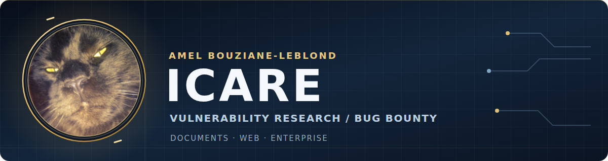

  

  
  
  

  <strong>Bug bounty hunter · Vulnerability researcher</strong> 
  Document security · Web applications · Enterprise software

  
  
  

Distinct CVE identifiers with named public credit. Co-credits included; an identifier is not necessarily an independent vulnerability.

## About

I'm **Amel Bouziane-Leblond**—**Icare** online. I research security issues from document formats to enterprise platforms, and publish reproducible findings through coordinated disclosure.

Some findings are collaborative, including work with [Supr4s](https://github.com/supr4s), [wlayzz](https://github.com/wlayzz), and [truff](https://github.com/truff77). The linked advisories identify the exact contributors.

## Research highlights

| Focus | Selected disclosures |
|:--|:--|
| 📄 Document security | [LibreOffice CVE-2025-0514](https://www.libreoffice.org/about-us/security/advisories/cve-2025-0514) · [Apache OpenOffice CVE-2023-47804](https://www.openoffice.org/security/cves/CVE-2023-47804.html) |
| 🔑 LDAP trust boundaries | [Jenkins CVE-2026-48916 / CVE-2026-48917](https://www.jenkins.io/security/advisory/2026-05-27/#SECURITY-3654) · [Sonatype CVE-2026-3048](https://support.sonatype.com/hc/en-us/articles/51591695462675-CVE-2026-3048-Nexus-Repository-3-Improper-LDAP-Referral-Handling-2026-05-11) |
| 🧩 Enterprise applications | [Milestone CVE-2026-3014](https://www.cve.org/CVERecord?id=CVE-2026-3014) · [Kiteworks advisories](#kiteworks--68-cve-credits) |

## Open-source projects

- [**LibreOffice_Tips_Bug_Bounty**](https://github.com/Icare1337/LibreOffice_Tips_Bug_Bounty) — OOXML and ODF test cases for document-security research.
- [**CVE-Monitor**](https://github.com/Icare1337/CVE-Monitor) — CVE monitoring and triage dashboard.
- [**GhostScript**](https://github.com/Icare1337/GhostScript) — PostScript security test cases.

## Disclosure index

### Beyond Kiteworks · 15 public credits

| Year | Vendor / project | CVE |
|:--|:--|:--|
| 2026 | Jenkins LDAP Plugin | [CVE-2026-48916](https://www.jenkins.io/security/advisory/2026-05-27/#SECURITY-3654) · [CVE-2026-48917](https://www.jenkins.io/security/advisory/2026-05-27/#SECURITY-3654) |
| 2026 | Sonatype Nexus Repository | [CVE-2026-3048](https://support.sonatype.com/hc/en-us/articles/51591695462675-CVE-2026-3048-Nexus-Repository-3-Improper-LDAP-Referral-Handling-2026-05-11) |
| 2026 | Milestone XProtect | [CVE-2026-3014](https://www.cve.org/CVERecord?id=CVE-2026-3014) |
| 2025 | Red Hat / Keycloak | [CVE-2025-13467](https://www.cve.org/CVERecord?id=CVE-2025-13467) |
| 2025 | Collabora Online | [CVE-2025-24796](https://github.com/CollaboraOnline/online/security/advisories/GHSA-4jjq-vgqp-qw45) |
| 2025 | Adobe Commerce | [CVE-2025-24406](https://helpx.adobe.com/security/products/magento/apsb25-08.html) |
| 2025 | LibreOffice | [CVE-2025-1080](https://www.libreoffice.org/about-us/security/advisories/cve-2025-1080) · [CVE-2025-0514](https://www.libreoffice.org/about-us/security/advisories/cve-2025-0514) |
| 2025 | Apache OpenOffice | [CVE-2025-64401](https://www.openoffice.org/security/cves/CVE-2025-64401.html) |
| 2024 | Adobe Commerce | [CVE-2024-39399](https://helpx.adobe.com/security/products/magento/apsb24-61.html) |
| 2024 | LibreOffice | [CVE-2024-3044](https://www.libreoffice.org/about-us/security/advisories/CVE-2024-3044) |
| 2023 | Apache OpenOffice | [CVE-2023-47804](https://www.openoffice.org/security/cves/CVE-2023-47804.html) |
| 2023 | LibreOffice | [CVE-2023-2255](https://www.libreoffice.org/about-us/security/advisories/CVE-2023-2255) |
| 2023 | Open-Xchange | [CVE-2023-26435](https://seclists.org/fulldisclosure/2023/Jun/8) |

The two Jenkins CVEs describe different consequences of **one report**. Apache OpenOffice [CVE-2025-64401](https://www.openoffice.org/security/cves/CVE-2025-64401.html) addresses the same underlying issue that LibreOffice tracks as CVE-2023-2255.

### Kiteworks · 68 CVE credits

**67 Kiteworks advisories** explicitly acknowledge Icare; one additional published CVE credits Icare in its CNA record. The severity grouping below follows the 67 available vendor advisories. Collaborators and exact attribution vary by finding—please follow each advisory rather than treating the entire list as solo work.

<strong>Critical · 5 CVEs</strong>

- [CVE-2026-102147](https://github.com/kiteworks/security-advisories/security/advisories/GHSA-xgh2-fgj6-w93r) · [CVE-2026-102115](https://github.com/kiteworks/security-advisories/security/advisories/GHSA-q76w-qv9j-q639) · [CVE-2026-102095](https://github.com/kiteworks/security-advisories/security/advisories/GHSA-f252-4w8q-g74g) · [CVE-2026-85066](https://github.com/kiteworks/security-advisories/security/advisories/GHSA-rwpq-5xfv-54pv) · [CVE-2026-54154](https://github.com/kiteworks/security-advisories/security/advisories/GHSA-5xhq-9wq3-rvj6)

<strong>High · 43 CVEs</strong>

- [CVE-2026-102143](https://github.com/kiteworks/security-advisories/security/advisories/GHSA-3p9g-jh62-8f89) · [CVE-2026-102142](https://github.com/kiteworks/security-advisories/security/advisories/GHSA-gmgg-7xhc-75f9) · [CVE-2026-102132](https://github.com/kiteworks/security-advisories/security/advisories/GHSA-qx8c-x3hv-c25g) · [CVE-2026-102131](https://github.com/kiteworks/security-advisories/security/advisories/GHSA-62f6-c955-4fhq) · [CVE-2026-102130](https://github.com/kiteworks/security-advisories/security/advisories/GHSA-m92m-q8cf-rcch)

- [CVE-2026-102129](https://github.com/kiteworks/security-advisories/security/advisories/GHSA-4gcf-w86v-34rp) · [CVE-2026-102126](https://github.com/kiteworks/security-advisories/security/advisories/GHSA-ccfx-6hq4-fx4g) · [CVE-2026-102123](https://github.com/kiteworks/security-advisories/security/advisories/GHSA-vcx7-3759-27xm) · [CVE-2026-102120](https://github.com/kiteworks/security-advisories/security/advisories/GHSA-m968-434m-rgwp) · [CVE-2026-102119](https://github.com/kiteworks/security-advisories/security/advisories/GHSA-3r3r-hp4c-pxmh)

- [CVE-2026-102118](https://github.com/kiteworks/security-advisories/security/advisories/GHSA-8pmh-222g-6j48) · [CVE-2026-102117](https://github.com/kiteworks/security-advisories/security/advisories/GHSA-5rhv-f48q-gq5v) · [CVE-2026-102116](https://github.com/kiteworks/security-advisories/security/advisories/GHSA-pf8p-p269-4mjv) · [CVE-2026-102114](https://github.com/kiteworks/security-advisories/security/advisories/GHSA-p5q5-49j9-hx8w) · [CVE-2026-102113](https://github.com/kiteworks/security-advisories/security/advisories/GHSA-gwj7-wxrr-28v5)

- [CVE-2026-102112](https://github.com/kiteworks/security-advisories/security/advisories/GHSA-658c-86vw-g9hf) · [CVE-2026-102108](https://github.com/kiteworks/security-advisories/security/advisories/GHSA-837h-99j2-hxjr) · [CVE-2026-102101](https://github.com/kiteworks/security-advisories/security/advisories/GHSA-x5hx-fgrp-prvf) · [CVE-2026-102100](https://github.com/kiteworks/security-advisories/security/advisories/GHSA-vr65-9jwc-jgjx) · [CVE-2026-102099](https://github.com/kiteworks/security-advisories/security/advisories/GHSA-qj2g-2wfr-wg43)

- [CVE-2026-102098](https://github.com/kiteworks/security-advisories/security/advisories/GHSA-cqg3-857q-cqj6) · [CVE-2026-102097](https://github.com/kiteworks/security-advisories/security/advisories/GHSA-465g-wpvm-8qmr) · [CVE-2026-102096](https://github.com/kiteworks/security-advisories/security/advisories/GHSA-c3wx-5mx6-2qpg) · [CVE-2026-102093](https://github.com/kiteworks/security-advisories/security/advisories/GHSA-mq6c-p42h-75j5) · [CVE-2026-102092](https://github.com/kiteworks/security-advisories/security/advisories/GHSA-mhw9-vrqq-m434)

- [CVE-2026-102091](https://github.com/kiteworks/security-advisories/security/advisories/GHSA-m8mj-m4fv-jmrh) · [CVE-2026-102089](https://github.com/kiteworks/security-advisories/security/advisories/GHSA-p853-p65q-2vc8) · [CVE-2026-95841](https://github.com/kiteworks/security-advisories/security/advisories/GHSA-phpv-mw9m-r8vh) · [CVE-2026-85069](https://github.com/kiteworks/security-advisories/security/advisories/GHSA-j4px-xvp8-jf7v) · [CVE-2026-85067](https://github.com/kiteworks/security-advisories/security/advisories/GHSA-377c-mj94-f4q4)

- [CVE-2026-77428](https://github.com/kiteworks/security-advisories/security/advisories/GHSA-vm9w-h57c-m9pj) · [CVE-2026-63486](https://github.com/kiteworks/security-advisories/security/advisories/GHSA-cj2q-mggw-76v5) · [CVE-2026-62159](https://github.com/kiteworks/security-advisories/security/advisories/GHSA-wwx9-vvxv-rrr3) · [CVE-2026-62158](https://github.com/kiteworks/security-advisories/security/advisories/GHSA-h575-f4w3-c8pr) · [CVE-2026-34843](https://github.com/kiteworks/security-advisories/security/advisories/GHSA-mhc9-4pph-2r9x)

- [CVE-2026-33059](https://github.com/kiteworks/security-advisories/security/advisories/GHSA-2g84-7w63-p97g) · [CVE-2026-28349](https://github.com/kiteworks/security-advisories/security/advisories/GHSA-r6v3-9qp8-mpg2) · [CVE-2026-28347](https://github.com/kiteworks/security-advisories/security/advisories/GHSA-pcg3-c3qc-p63m) · [CVE-2026-28283](https://github.com/kiteworks/security-advisories/security/advisories/GHSA-7q9c-5w7m-q7hh) · [CVE-2026-24782](https://github.com/kiteworks/security-advisories/security/advisories/GHSA-849r-gm3r-4v5c)

- [CVE-2026-24752](https://github.com/kiteworks/security-advisories/security/advisories/GHSA-6798-vf3h-wcwr) · [CVE-2026-24751](https://github.com/kiteworks/security-advisories/security/advisories/GHSA-xp8m-wmmp-f947) · [CVE-2025-53899](https://github.com/kiteworks/security-advisories/security/advisories/GHSA-5gx5-vcpp-8cr5)

<strong>Medium · 17 CVEs</strong>

- [CVE-2026-102145](https://github.com/kiteworks/security-advisories/security/advisories/GHSA-h97r-j99c-q8xc) · [CVE-2026-102141](https://github.com/kiteworks/security-advisories/security/advisories/GHSA-m39v-w8fv-gf3m) · [CVE-2026-102140](https://github.com/kiteworks/security-advisories/security/advisories/GHSA-wfxj-p5jc-jqjw) · [CVE-2026-102136](https://github.com/kiteworks/security-advisories/security/advisories/GHSA-rpxx-jm93-w5j7) · [CVE-2026-102135](https://github.com/kiteworks/security-advisories/security/advisories/GHSA-vmwr-r5xq-hp49)

- [CVE-2026-102133](https://github.com/kiteworks/security-advisories/security/advisories/GHSA-53qp-jmrc-2g5j) · [CVE-2026-102124](https://github.com/kiteworks/security-advisories/security/advisories/GHSA-q85p-q4v6-7w6f) · [CVE-2026-102107](https://github.com/kiteworks/security-advisories/security/advisories/GHSA-wv69-6ghf-h3c4) · [CVE-2026-97372](https://github.com/kiteworks/security-advisories/security/advisories/GHSA-q874-j4f7-j389) · [CVE-2026-62244](https://github.com/kiteworks/security-advisories/security/advisories/GHSA-c669-hm9h-cr6m)

- [CVE-2026-62161](https://github.com/kiteworks/security-advisories/security/advisories/GHSA-mf3v-4wrj-jjwc) · [CVE-2026-46613](https://github.com/kiteworks/security-advisories/security/advisories/GHSA-77fw-7jwf-7c9w) · [CVE-2026-42243](https://github.com/kiteworks/security-advisories/security/advisories/GHSA-6c8h-46v5-xcmw) · [CVE-2026-28271](https://github.com/kiteworks/security-advisories/security/advisories/GHSA-rmfx-6h9w-fq87) · [CVE-2026-28270](https://github.com/kiteworks/security-advisories/security/advisories/GHSA-v8x9-vwg6-cj45)

- [CVE-2026-28269](https://github.com/kiteworks/security-advisories/security/advisories/GHSA-6j64-6fpp-9453) · [CVE-2026-27725](https://github.com/kiteworks/security-advisories/security/advisories/GHSA-9fqq-qjqh-vh4w)

<strong>Low · 2 CVEs</strong>

- [CVE-2026-102138](https://github.com/kiteworks/security-advisories/security/advisories/GHSA-q9w9-c5hj-87jm) · [CVE-2026-42242](https://github.com/kiteworks/security-advisories/security/advisories/GHSA-f26q-22vc-8h92)

The additional [CVE-2026-102125](https://www.cve.org/CVERecord?id=CVE-2026-102125) is credited to Icare in its published CNA record. Its referenced GitHub advisory was unavailable when this page was prepared.

Earlier research record

I also list [CVE-2020-14011](https://www.cve.org/CVERecord?id=CVE-2020-14011) in my historical research record. Its public CNA entry does not name a finder, so it is **not included** in the 83-credit counter above.

---

Public disclosures and repository links checked on 4 October 2026. Vulnerability reports are credited as published by the vendors or CVE CNAs.

